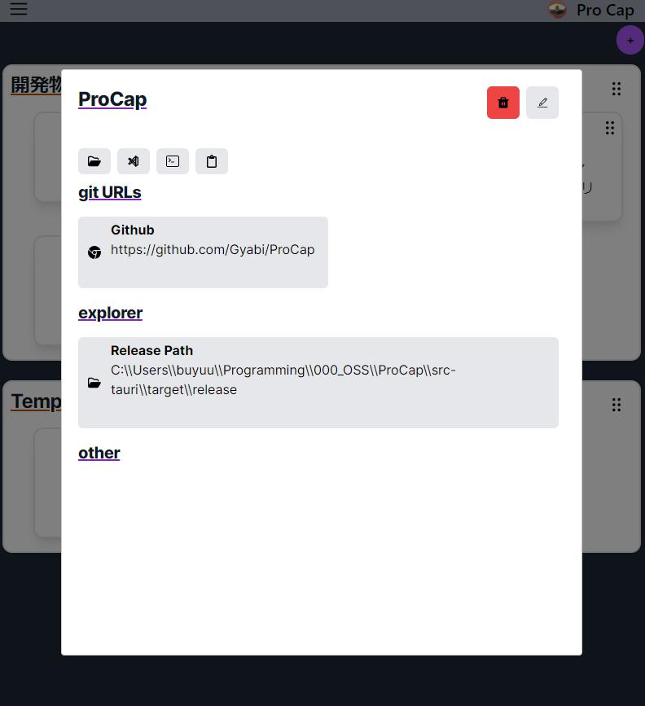

<div align="center">
    
</div>

# ProCap
## Overview
ProCapは、ローカルプロジェクトフォルダを管理するためのアプリケーションです。


## Demo
<div style="display: flex; flex-wrap: wrap; justify-content: center;">
    
    
</div>

## Features
- **Project Creation**  
  プロジェクトには1つのメインパスを紐づけることができます。UIを使用して以下の操作が可能です:
  - エクスプローラーで開く
  - Visual Studio Codeで開く
  - コマンドラインで開く
  - パスをクリップボードにコピー

- **Git URL Management**  
  任意の数のGit URLを登録し、ブラウザで即座にで開くことができます。

- **Path Management**  
  任意の数のパスを登録し、即座にエクスプローラーで開くことができます。

- **URL Management**  
  任意のURLを登録し、ブラウザで即座に開くことができます。

- **Container Feature**  
  プロジェクトをまとめたコンテナというグループを作成し、表示レイアウトを変更することができます。


## Requirement
- tauri 1.4.0
- nextjs 14.0.3
- typescript ^5
- tailwindcss 3.3.0

## Installation
リリースページからインストーラをダウンロードするか、以下の手順でローカルにクローンしてインストールしてください。

```bash
npm install
cargo tauri build
```
## Author
- Kano

## License
ProCap is under [MIT license](https://en.wikipedia.org/wiki/MIT_License).
